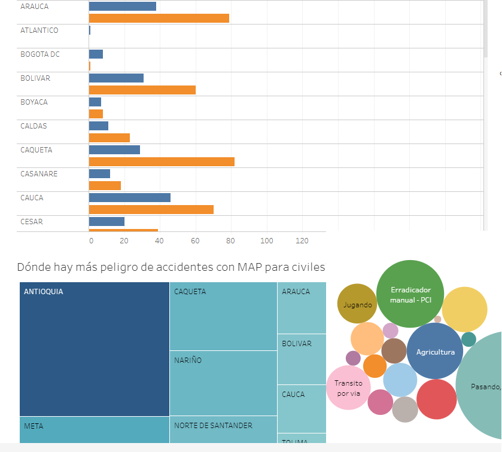
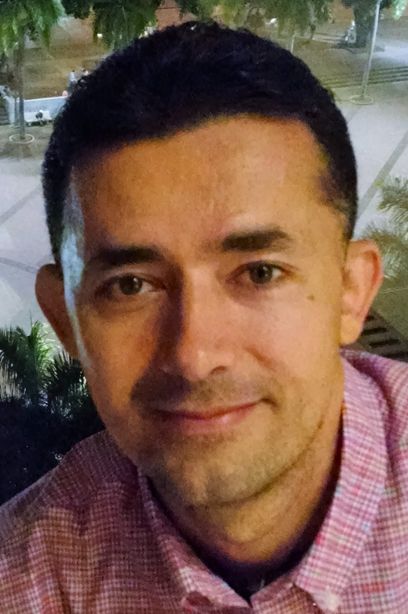

# Realidad-Minas-Anti-Persona
Este sitio presenta descubrimientos realizados a partir del análisis de datos recopilados en 2017 sobre accidentes reportados en todo el país con minas anti-personas.
<h3>Objetivos</h3>
Este estudio pretende evidenciar descubrimientos que permitan a las autoridades competentes tomar decisiones acertadas sobre todo el tema que envuelve la problemática de las minas anti-personas, como lo son la población más afectada, zonas más densamente sembradas, mejores estrategias de desminado, etc.
<h3>Tecnologías Usadas</h3>
Las tecnologías usadas para este estudio no requieren de ningún tipo de instalación previa, y son:
<ul>
  <li>Tableau:  Para hacer la exploración inicial de los datos</li>
  <li>D3.js:  Para hacer la visualización final de los datos</li>
</ul>
<h3>Visualizar Proyecto</h3>
<a href="https://carlosacalvo.github.io/Realidad-Minas-Anti-Persona"/>

Ver proyecto</a>
<h3>Licencia</h3>
Licenciado bajo los términos de <a href="LICENCE">MIT</a>
<h3>Autor</h3>

<a href=https://carlosacalvo.github.io>Carlos Andres Calvo Garcia</a>
